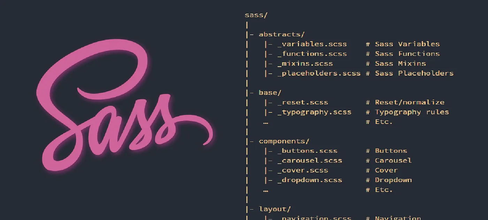

# SASS

Sass, or "Syntactically Awesome StyleSheets", is a language extension of CSS. It adds features that aren't available in basic CSS, which make it easier for you to simplify and maintain the style sheets for your projects.

In this Sass course, you'll learn how to store data in variables, nest CSS, create reusable styles with mixins, add logic and loops to your styles, and more.

### 1. [Store Data with Sass Variables](https://github.com/pradipchaudhary/SASS/tree/master/01%20Store%20Data%20with%20Sass%20Variables)

One feature of Sass that's different than CSS is it uses variables. They are declared and set to store data, similar to JavaScript.

In JavaScript, variables are defined using the let and const keywords. In Sass, variables start with a $ followed by the variable name.

Here are a couple examples:

2. [Nest CSS with Sass](https://github.com/pradipchaudhary/SASS/tree/master/02%20Nest%20CSS%20with%20Sass)
3. [Create Reusable CSS with Mixins](https://github.com/pradipchaudhary/SASS/tree/master/03%20Create%20Reusable%20CSS%20with%20Mixins)
4. [Use @if and @else to Add Logic To Your Styles](https://github.com/pradipchaudhary/SASS/tree/master/04%20Use%20%40if%20and%20%40else%20to%20Add%20Logic%20To%20Your%20Styles)
5. [Use @for to Create a Sass Loop](https://github.com/pradipchaudhary/SASS/tree/master/05%20Use%20%40for%20to%20Create%20a%20Sass%20Loop)
6. [Use @each to Map Over Items in a List](https://github.com/pradipchaudhary/SASS/tree/master/05%20Use%20%40for%20to%20Create%20a%20Sass%20Loop)
7. [Apply a Style Until a Condition is Met with @while](https://github.com/pradipchaudhary/SASS/tree/master/07%20Apply%20a%20Style%20Until%20a%20Condition%20is%20Met%20with%20%40while)
8. [Split Your Styles into Smaller Chunks with Partials](https://github.com/pradipchaudhary/SASS/tree/master/08%20Split%20Your%20Styles%20into%20Smaller%20Chunks%20with%20Partials)
9. [Extend One Set of CSS Styles to Another Element](https://github.com/pradipchaudhary/SASS/tree/master/09%20Extend%20One%20Set%20of%20CSS%20Styles%20to%20Another%20Element)
